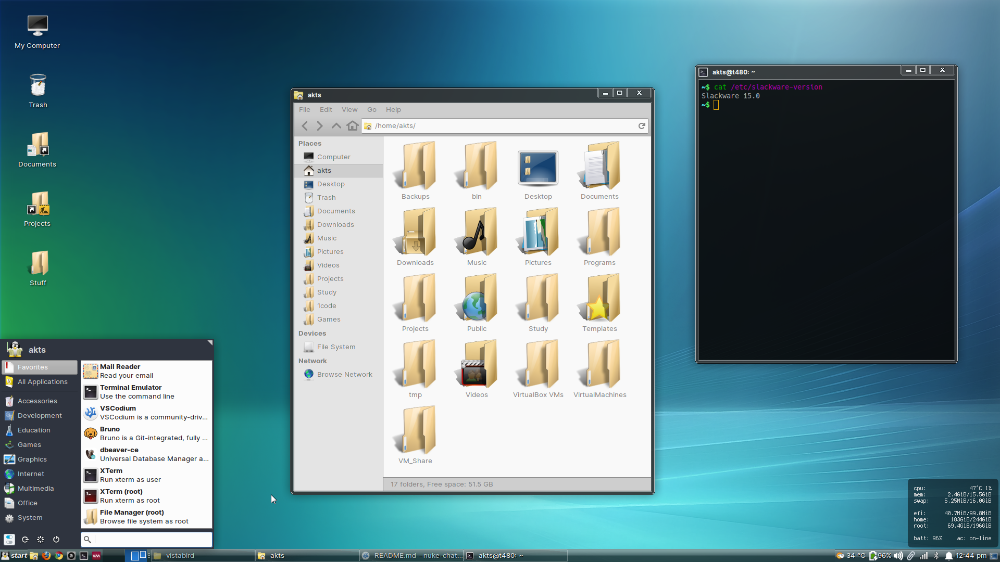

# vistabird

A vista-ish transformation pack for the xfce desktop environment.



## Installation


1. For the gtk/ui theme, extract `vistabird.tar.gz` in the themes folder. Then copy it to your preferred `themes` folder.

    ```
    $ mkdir -p ~/.themes
    $ cp -r themes/vistabird ~/.themes/
    ```

    or for system wide installation, do this

    ```
    # sudo cp -r themes/vistabird /usr/share/themes
    ```

    Then we make a local gtk.css update to make the look sorta-complete for gtk-3 csd applications.

    ```
    $ mv ~/.config/gtk-3.0 ~/.config/gtk-3.0-backup
    $ cp -r tweaks/gtk-3.0 ~/.config/gtk-3.0
    ```

    - Select vistabird in xfce settings > Appearance > Style
    - Select vistabird in xfce settings > Window Manager > Style

2. For the icon theme, make sure you have installed the following two icon themes before hand. Get the latest release for each of them
    - [Oxylite](https://github.com/mx-2/oxylite-icon-theme/releases)
    - [Obsidian](https://github.com/madmaxms/iconpack-obsidian/releases)

    Extract the oxylite and obsidian icon themes to your `$HOME/.icons` or `/usr/share/icons` folder. Edit oxylite's index.theme file, so that the `Inherits=` line looks like so.

    ```
    [Icon Theme]
    Name=Oxylite PNG icons
    Comment=Skeuomorphic SVG icon theme
    Inherits=Obsidian,hicolor
    Directories=actions,apps,categories,devices,emblems,emotes,mimetypes,places,status,ui
    ```

    Now extract the `vistabird-icon-theme.tar.gz` archive inside the `icons` folder.

    ```
    $ cd icons
    $ tar xzvf vistabird-icon-theme.tar.gz
    $ cd ..
    $ mkdir -p ~/.icons
    $ cp -r icons/vistabird ~/.icons/
    ```

    or for system wide installation, do this

    ```
    # sudo cp -r icons/vistabird /usr/share/icons
    ```

    - Select vistabird in xfce settings > Mouse and touchpad > Theme
    - Select vistabird in xfce settings > Appearance > Icons

3. For the panel background, right-click panel > Panel preferences > Appearance > Background
    ```
    Style = Background Image
    File = /usr/share/themes/vistabird/extra/panel-backgrounds/vista-panel2.png
    ```

4. For the start menu, the xfce4-whisker-menu is used. Right click whisker menu > Properties > Panel button and in the title box, put in 
    ```
    <span style="italic" weight="bold">start</span>
    ```
5. **[Optional]** Copy the conky folder to `$HOME/.config/conky/vistabird/`. Then launch conky with 
    ```
    conky --config ~/.config/conky/vistabird/conkyrc.lua
    ```
    To make conky launch on startup, Xfce Settings > Session and Startup > Application Autostart. Click on the `+` button for add application

    ```
    Name: Conky
    Description: Conky launch on startup
    Command: conky --config /home/youruser/.config/conky/vistabird/conkyrc.lua
    Trigger: on login
    ```

## Credits

All assets found in this repo have a THANKS file attached crediting the original authors/sources. I simply collected them and claim no ownership.